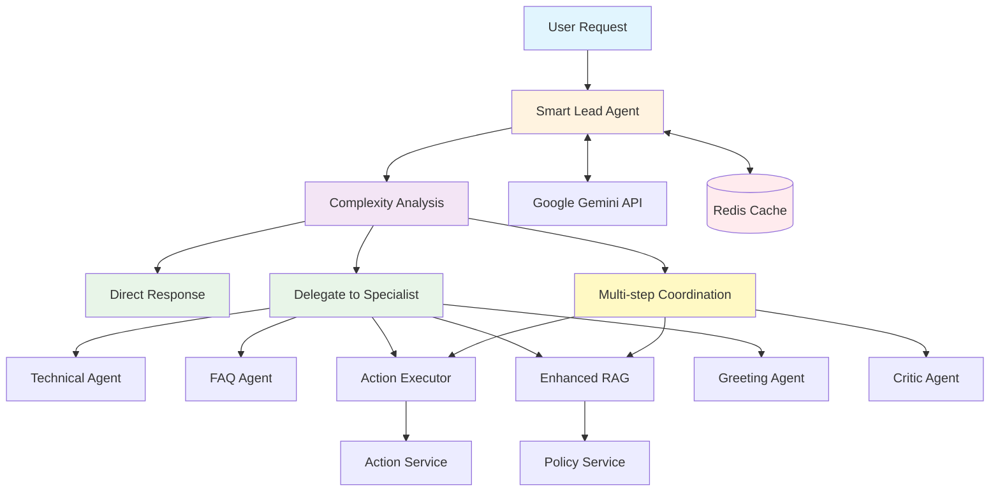

# Campus Helpdesk AI

Hệ thống hỗ trợ sinh viên thông minh sử dụng **kiến trúc Lead-Agent với Multi-Agent Orchestration**, được thiết kế để giải quyết các vấn đề và yêu cầu phức tạp của sinh viên một cách hiệu quả và thông minh.

## Tổng quan Hệ thống

### Kiến trúc Multi-Agent Mới

Hệ thống sử dụng kiến trúc **Lead-Agent Orchestration** với các thành phần chính:

1. **Smart Lead Agent**: Điều phối chính, phân tích độ phức tạp và quyết định cách xử lý
2. **Specialized Agents**: Các chuyên gia chuyên trách từng lĩnh vực
3. **Tool Integration**: Tích hợp công cụ thực hiện hành động cụ thể
4. **Quality Assurance**: Đánh giá và cải thiện chất lượng phản hồi

### Các Agent Chuyên môn

- **Technical Agent**: Xử lý vấn đề kỹ thuật, IT, mật khẩu, hệ thống
- **FAQ Agent**: Trả lời về quy định, chính sách, thông tin trường
- **Action Executor Agent**: Thực hiện các công việc cụ thể (đặt phòng, gia hạn thẻ, tạo ticket...)
- **Enhanced RAG Agent**: Tìm kiếm và trả lời dựa trên tài liệu chính thức
- **Critic Agent**: Đánh giá chất lượng phản hồi và đề xuất cải thiện
- **Greeting Agent**: Chào hỏi và tạo không khí thân thiện

## Kiến trúc Triển khai (Production Architecture)

Kiến trúc triển khai được thiết kế để hoạt động trên một máy chủ duy nhất sử dụng Docker Compose, bao gồm các services chính:

### Core Services

-   **Frontend Service** (React + Vite + Nginx):
    -   Giao diện người dùng hiện đại với chat interface
    -   Reverse proxy chuyển tiếp API requests đến Gateway
    -   Phục vụ static assets và handle routing

-   **Gateway Service** (FastAPI + Multi-Agent System):
    -   **Lead-Agent Orchestration**: Điều phối thông minh các agents
    -   **Workflow Planning**: Lập kế hoạch cho yêu cầu phức tạp
    -   **Agent Management**: Quản lý và điều phối các specialized agents
    -   **LLM Integration**: Tích hợp với Google Gemini API
    -   **Session Management**: Quản lý phiên chat và context

-   **Redis Service**:
    -   Session storage và chat history
    -   Agent memory và workflow state
    -   Caching cho performance optimization

### Extended Services (Microservices)

-   **Action Service**: Thực hiện các hành động cụ thể (email, booking, password reset...)
-   **Policy Service**: Quản lý tài liệu và knowledge base với RAG
-   **Ticket Service**: Hệ thống quản lý support tickets
-   **Escalation Service**: Xử lý escalation và routing phức tạp

### Luồng Xử lý Thông minh

#### Simple Request Flow:
```
User Request → Smart Lead Agent → Complexity Analysis → Direct Response/Simple Routing → Specialized Agent → Response
```

#### Complex Request Flow:
```
User Request → Smart Lead Agent → Workflow Planning → Multi-step Execution:
    Step 1: Enhanced RAG Agent (tìm thông tin policy)
    Step 2: Action Executor Agent (thực hiện tools)  
    Step 3: Critic Agent (đánh giá chất lượng)
→ Result Synthesis → Final Response
```

#### Agent Decision Making:
- **Direct Response**: Câu hỏi đơn giản, chào hỏi, thông tin cơ bản
- **Delegate to Specialist**: Chuyển cho chuyên gia cụ thể (technical, FAQ, action)
- **Multi-step Coordination**: Yêu cầu phức tạp cần nhiều bước và nhiều agents



## Tính năng nổi bật

### 🤖 Lead-Agent Orchestration
- **Intelligent Decision Making**: Phân tích độ phức tạp và chọn strategy phù hợp
- **Workflow Planning**: Lập kế hoạch chi tiết cho yêu cầu phức tạp
- **Multi-Agent Coordination**: Điều phối nhiều agents hoạt động đồng bộ

### 🔧 Tool Integration
- **Password Reset**: Đặt lại mật khẩu tự động
- **Room Booking**: Đặt phòng học, phòng họp
- **Library Services**: Gia hạn thẻ thư viện
- **Ticket Creation**: Tạo ticket support tự động
- **Email Notifications**: Gửi email thông báo

### 📚 Enhanced RAG (Retrieval-Augmented Generation)
- **Smart Document Search**: Tìm kiếm thông minh trong knowledge base
- **Query Optimization**: Tối ưu hóa câu truy vấn tự động
- **Context-Aware Answers**: Trả lời dựa trên context và lịch sử

### 🎯 Quality Assurance
- **Critic Agent**: Đánh giá chất lượng phản hồi theo 6 tiêu chí
- **Continuous Improvement**: Đề xuất cải thiện tự động
- **Response Validation**: Kiểm tra tính chính xác và an toàn

### 💬 Advanced Chat Features
- **Session Management**: Quản lý phiên chat thông minh
- **Context Preservation**: Duy trì ngữ cảnh xuyên suốt cuộc trò chuyện
- **Multi-turn Conversations**: Hỗ trợ hội thoại nhiều lượt phức tạp

### 🎤 Voice Chat Integration
- **Speech-to-Text**: Nhận diện giọng nói tiếng Việt bằng OpenAI Whisper  
- **Text-to-Speech**: Chuyển đổi phản hồi thành giọng nói với ElevenLabs
- **Auto-TTS**: Bot replies tự động phát âm thanh sau khi xử lý `/ask`
- **Voice Toggle**: User có thể bật/tắt auto-speak trong giao diện
- **Audio Caching**: Cache audio files để tiết kiệm credit và tăng tốc độ
- **Browser Policy Handling**: Tự động xử lý autoplay restrictions
- **Multi-voice Support**: Configurable voice selection và quality settings
- **Seamless Integration**: Tích hợp mượt mà với text chat hiện có

## API Endpoints Mới

### User Management
- `GET /me` - Thông tin profile người dùng hiện tại
- `GET /me/tickets` - Danh sách tickets của người dùng

### Chat & Session Management  
- `POST /ask` - Gửi tin nhắn (với Lead-Agent orchestration)
- `POST /tts` - Convert text to speech (ElevenLabs integration)
- `POST /voice-chat` - Hội thoại bằng giọng nói (STT + TTS)
- `GET /sessions/{session_id}/history` - Lịch sử chat theo session
- `GET /agents` - Danh sách agents và trạng thái

### Tools & Actions
- `GET /tools` - Danh sách tools có sẵn
- `POST /call_tool` - Thực hiện tool call trực tiếp
- `POST /evaluate` - Đánh giá chất lượng response

### Workflow Management
- `GET /workflows/{id}` - Trạng thái workflow
- `GET /health` - Health check và monitoring

## Hướng dẫn Triển khai (Deployment)

Quy trình này tập trung vào việc build các Docker image ở môi trường local, đẩy chúng lên một container registry (như Docker Hub), và sau đó triển khai trên một máy chủ production.

## Cấu hình Environment Variables

### Core Configuration
```env
# LLM Provider Configuration
LLM_PROVIDER=gemini
LLM_MODEL=gemini-1.5-flash
GOOGLE_API_KEY=your_google_api_key_here

# Lead-Agent Settings
LEAD_AGENT_MAX_WORKFLOWS=100
LEAD_AGENT_COMPLEXITY_THRESHOLD=0.7
LEAD_AGENT_ENABLE_CRITIC=true

# Performance Settings
MAX_CONCURRENT_WORKFLOWS=10
AGENT_RESPONSE_TIMEOUT=60
REDIS_URL=redis://redis:6379/0

# Service URLs (Microservices)
POLICY_URL=http://policy:8000
TICKET_URL=http://ticket:8000
ACTION_URL=http://action:8000
ESCALATION_URL=http://escalation:8000

# Gateway Settings
GATEWAY_PORT=8000
JWT_SECRET_KEY=your_jwt_secret_key_here
JWT_ALGORITHM=HS256
JWT_EXPIRE_MINUTES=60
```

### Email Service Configuration (Action Service)
```env
# SMTP Configuration
SMTP_SERVER=smtp.gmail.com
SMTP_PORT=587
SMTP_USERNAME=your_email@gmail.com
SMTP_PASSWORD=your_app_password
SMTP_FROM_EMAIL=noreply@campus-helpdesk.edu
```

## Hướng dẫn Triển khai chi tiết

### Yêu cầu hệ thống

-   **Local Machine**: Docker và Docker Compose đã được cài đặt
-   **Server**: Docker và Docker Compose đã được cài đặt
-   **Container Registry**: Tài khoản Docker Hub hoặc registry tương tự
-   **API Keys**: Google Gemini API key cho LLM integration

---

### Bước 1: Build và Đẩy Docker Images (Thực hiện ở Local)

#### 1.1. Build Frontend Image

Di chuyển vào thư mục frontend và build:

```bash
cd intel-campus-ai-main
docker build -t your-dockerhub-username/campus-helpdesk-frontend:latest .
```

#### 1.2. Build Gateway Service (Backend)

Quay lại thư mục gốc và build gateway service với multi-agent system:

```bash
cd ..
docker build -f backend.Dockerfile -t your-dockerhub-username/campus-helpdesk-gateway:latest .
```

#### 1.3. Build Microservices (Optional)

Nếu muốn chạy full microservices architecture:

```bash
# Action Service
docker build -f services/bases/Dockerfile --build-arg SERVICE_DIR=services/action -t your-dockerhub-username/campus-helpdesk-action:latest .

# Policy Service  
docker build -f services/bases/Dockerfile --build-arg SERVICE_DIR=services/policy -t your-dockerhub-username/campus-helpdesk-policy:latest .

# Ticket Service
docker build -f services/bases/Dockerfile --build-arg SERVICE_DIR=services/ticket -t your-dockerhub-username/campus-helpdesk-ticket:latest .
```

#### 1.4. Đẩy Images lên Registry

```bash
docker login

# Push core images
docker push your-dockerhub-username/campus-helpdesk-frontend:latest
docker push your-dockerhub-username/campus-helpdesk-gateway:latest

# Push microservices (if built)
docker push your-dockerhub-username/campus-helpdesk-action:latest
docker push your-dockerhub-username/campus-helpdesk-policy:latest
docker push your-dockerhub-username/campus-helpdesk-ticket:latest
```

---

### Bước 2: Cấu hình và Chạy trên Server

#### 2.1. Chuẩn bị Server

SSH vào server của bạn và tạo một thư mục để chứa các file cấu hình.

```bash
mkdir campus-helpdesk-deploy
cd campus-helpdesk-deploy
```

#### 2.2. Tạo file `docker-compose.yml`

Có 2 phiên bản triển khai:

##### Phiên bản Simple (Gateway + Frontend + Redis)
Tạo file `docker-compose.yml` (`nano docker-compose.yml`):

```yaml
services:
  frontend:
    image: your-dockerhub-username/campus-helpdesk-frontend:latest
    ports:
      - "80:80"
    restart: unless-stopped
    networks:
      - campus-net
    depends_on:
      - gateway

  gateway:
    image: your-dockerhub-username/campus-helpdesk-gateway:latest
    restart: unless-stopped
    environment:
      # Core LLM Configuration
      LLM_PROVIDER: ${LLM_PROVIDER}
      LLM_MODEL: ${LLM_MODEL}
      GOOGLE_API_KEY: ${GOOGLE_API_KEY}
      
      # Lead-Agent Settings
      LEAD_AGENT_MAX_WORKFLOWS: ${LEAD_AGENT_MAX_WORKFLOWS:-100}
      LEAD_AGENT_COMPLEXITY_THRESHOLD: ${LEAD_AGENT_COMPLEXITY_THRESHOLD:-0.7}
      LEAD_AGENT_ENABLE_CRITIC: ${LEAD_AGENT_ENABLE_CRITIC:-true}
      
      # Performance
      MAX_CONCURRENT_WORKFLOWS: ${MAX_CONCURRENT_WORKFLOWS:-10}
      AGENT_RESPONSE_TIMEOUT: ${AGENT_RESPONSE_TIMEOUT:-60}
      
      # Redis Connection
      REDIS_URL: redis://redis:6379/0
      
      # Gateway Settings
      GATEWAY_PORT: 8000
      JWT_SECRET_KEY: ${JWT_SECRET_KEY}
      
    networks:
      - campus-net
    depends_on:
      - redis

  redis:
    image: redis:7-alpine
    restart: unless-stopped
    networks:
      - campus-net
    volumes:
      - redis_data:/data

networks:
  campus-net:
    driver: bridge

volumes:
  redis_data:
```

##### Phiên bản Full Microservices (Sử dụng `docker-compose.yml` hiện có)
```bash
# Copy file docker-compose.yml từ repo
cp docker-compose.yml docker-compose.production.yml
# Chỉnh sửa image names trong file để sử dụng images từ registry
```

#### 2.3. Tạo file `.env`

Tạo file `.env` (`nano .env`) với configuration đầy đủ:

```env
# ===== CORE LLM CONFIGURATION =====
LLM_PROVIDER=gemini
LLM_MODEL=gemini-1.5-flash
GOOGLE_API_KEY=your_google_api_key_here

# ===== VOICE SERVICES =====
OPENAI_API_KEY=your_openai_api_key_here
ELEVENLABS_API_KEY=your_elevenlabs_api_key_here
ELEVENLABS_VOICE_ID=21m00Tcm4TlvDq8ikWAM

# ===== LEAD-AGENT CONFIGURATION =====
LEAD_AGENT_MAX_WORKFLOWS=100
LEAD_AGENT_COMPLEXITY_THRESHOLD=0.7
LEAD_AGENT_ENABLE_CRITIC=true

# ===== PERFORMANCE SETTINGS =====
MAX_CONCURRENT_WORKFLOWS=10
AGENT_RESPONSE_TIMEOUT=60

# ===== SECURITY =====
JWT_SECRET_KEY=your_super_secret_jwt_key_here_make_it_long_and_random
JWT_ALGORITHM=HS256
JWT_EXPIRE_MINUTES=60

# ===== MICROSERVICES URLS (if using full architecture) =====
POLICY_URL=http://policy:8000
TICKET_URL=http://ticket:8000  
ACTION_URL=http://action:8000
ESCALATION_URL=http://escalation:8000

# ===== EMAIL CONFIGURATION (for Action Service) =====
SMTP_SERVER=smtp.gmail.com
SMTP_PORT=587
SMTP_USERNAME=your_email@gmail.com
SMTP_PASSWORD=your_app_password
SMTP_FROM_EMAIL=noreply@campus-helpdesk.edu

# ===== DATABASE & CACHE =====
REDIS_URL=redis://redis:6379/0
```

#### 2.4. Khởi động hệ thống

```bash
# Khởi động tất cả services
docker compose up -d

# Kiểm tra logs
docker compose logs -f gateway

# Kiểm tra trạng thái
docker compose ps
```

Hệ thống sẽ khả dụng tại địa chỉ IP của server.

---

### Bước 3: Testing và Monitoring

#### 3.1. Health Checks

```bash
# Kiểm tra Gateway health
curl http://your-server-ip/api/health

# Kiểm tra agents status  
curl http://your-server-ip/api/agents

# Test chat functionality
curl -X POST http://your-server-ip/api/ask \
  -H "Content-Type: application/json" \
  -d '{"message": "Xin chào", "session_id": "test-session"}'
```

#### 3.2. Monitoring

```bash
# Xem logs real-time
docker compose logs -f gateway

# Monitor resource usage
docker stats

# Kiểm tra Redis data
docker compose exec redis redis-cli
redis-cli> keys *
redis-cli> get "session:test-session"
```

#### 3.3. Troubleshooting

**Các vấn đề thường gặp:**

1. **LLM API Error**: Kiểm tra `GOOGLE_API_KEY` trong `.env`
2. **Agent Not Found**: Kiểm tra logs gateway để xem agent initialization
3. **Memory Issues**: Tăng resource limits hoặc giảm `MAX_CONCURRENT_WORKFLOWS`
4. **Redis Connection**: Kiểm tra Redis service và `REDIS_URL`

---

### Bước 4: Cập nhật hệ thống

Khi có thay đổi mã nguồn:

#### 4.1. Update Images
```bash
# Build và push images mới (ở local)
docker build -t your-dockerhub-username/campus-helpdesk-gateway:latest .
docker push your-dockerhub-username/campus-helpdesk-gateway:latest
```

#### 4.2. Deploy Updates
```bash
# Trên server
docker compose pull
docker compose up -d

# Rolling update (zero downtime)
docker compose up -d --no-deps gateway
```

## Development Setup

### Local Development

#### Prerequisites
```bash
# Install Python dependencies
pip install -r requirements-dev.txt

# Install Node.js dependencies  
cd intel-campus-ai-main
npm install
```

#### Running Locally
```bash
# Start Redis
docker run -d -p 6379:6379 redis:7-alpine

# Start Gateway (development mode)
cd services/gateway
uvicorn app:app --reload --port 8000

# Start Frontend (development mode) 
cd intel-campus-ai-main
npm run dev
```

### Testing

#### Unit Tests
```bash
# Run agent tests
python -m pytest tests/ -v

# Test specific agent
python -m pytest tests/test_lead_agent.py -v
```

#### Integration Tests
```bash
# Test API endpoints
python services/gateway/test_new_endpoints.py

# Test multi-agent workflows
python tests/test_workflows.py
```

## Monitoring và Performance

### Metrics to Monitor

1. **Response Times**: Agent processing time, LLM call latency
2. **Success Rates**: Workflow completion rate, tool execution success
3. **Resource Usage**: Memory consumption, CPU usage, Redis memory
4. **Error Rates**: Failed agent calls, LLM API errors, tool failures

### Performance Optimization

1. **Caching**: Implement response caching for frequent queries
2. **Load Balancing**: Scale Gateway service horizontally
3. **Resource Limits**: Set appropriate memory/CPU limits
4. **Async Processing**: Use async operations where possible

## Troubleshooting Guide

### Common Issues

| Issue | Possible Cause | Solution |
|-------|----------------|----------|
| Agent not responding | LLM API key invalid | Check `GOOGLE_API_KEY` |
| Tool execution fails | Action service down | Verify service connectivity |
| Memory leaks | Workflow state not cleaned | Check `LEAD_AGENT_MAX_WORKFLOWS` |
| Slow responses | High complexity threshold | Adjust `LEAD_AGENT_COMPLEXITY_THRESHOLD` |
| Authentication errors | JWT secret mismatch | Verify `JWT_SECRET_KEY` |

### Debug Commands

```bash
# Check agent manager status
docker compose exec gateway python -c "from agents import AgentManager; print('OK')"

# Test LLM connectivity
docker compose exec gateway python -c "from common.llm import chat; print(chat([{'role': 'user', 'content': 'test'}]))"

# Inspect Redis data
docker compose exec redis redis-cli monitor
```

## Contribution Guidelines

### Adding New Agents

1. Create new agent class inheriting from `BaseAgent`
2. Implement required `process()` method
3. Add agent to `EnhancedAgentManager`
4. Create corresponding prompt file in `prompts/agents/`
5. Add tests in `tests/agents/`

### Adding New Tools

1. Add tool specification to Action service
2. Update `ActionExecutorAgent` tool mapping
3. Add parameter extraction logic
4. Test tool integration end-to-end

---

## Tài liệu Tham khảo

- [Lead-Agent Implementation Guide](LEAD_AGENT_IMPLEMENTATION.md)
- [Implementation Summary](IMPLEMENTATION_SUMMARY.md)
- [Production README](README-PRODUCTION.md)
- [Agent Prompts](prompts/agents/)

## Support

Để được hỗ trợ, vui lòng:

1. Kiểm tra logs: `docker compose logs gateway`
2. Xem troubleshooting guide ở trên
3. Tạo issue với thông tin chi tiết về lỗi
4. Cung cấp relevant logs và environment configuration
