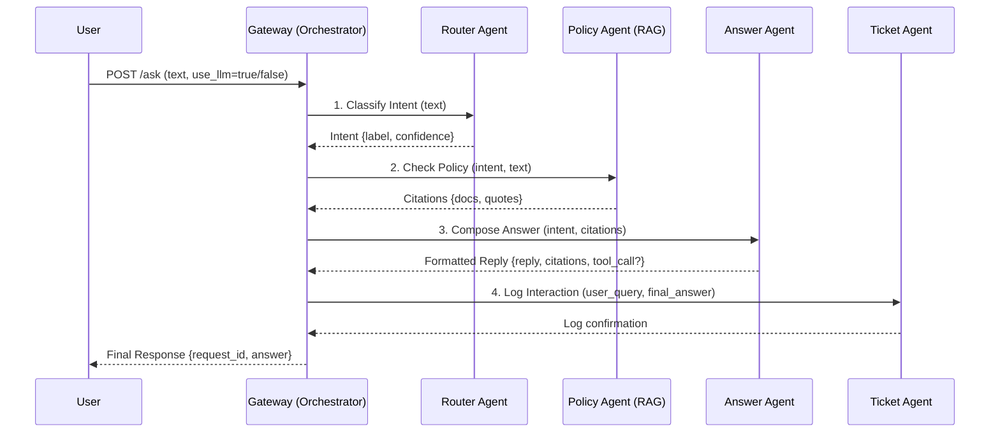

# Campus Helpdesk

This repository contains the source code for the Campus Helpdesk, a microservices-based application designed to assist students with common issues and requests.

## Architecture

The system is built on a microservices architecture, with the following key components:

-   **Gateway**: The main entry point for all requests. It orchestrates the flow between the other services.
-   **Router**: Determines the user's intent based on their query.
-   **Policy**: Checks for relevant policies and returns citations.
-   **Answer**: Composes a response to the user's query.
-   **Action**: Executes actions on behalf of the user (e.g., resetting a password).
-   **Ticket**: Manages helpdesk tickets.
-   **Escalation**: Summarizes tickets for human operators.
-   **Ingest**: Handles incoming messages from various channels (e.g., Zalo).

## Multi-Agent Workflow

The system operates as a coordinated multi-agent system where each microservice acts as a specialized agent. The `Gateway` service orchestrates the entire process.

### Workflow Diagram



### Step-by-Step Explanation

1.  **Request Reception (Gateway)**: A user sends a request to the `POST /ask` endpoint of the `Gateway`. The request includes the user's query (`text`) and an optional boolean `use_llm` to decide which workflow to use.

2.  **Intent Classification (Router Agent)**:
    *   The `Gateway` forwards the user's `text` to the `Router` agent.
    *   If `use_llm=true`, it calls the `/classify_llm` endpoint, which uses an LLM to determine the intent, confidence score, and any relevant entities.
    *   If `use_llm=false`, it calls the `/classify` endpoint, which uses a simpler, rule-based method.
    *   The `Router` agent returns a structured `intent` object.

3.  **Policy & Knowledge Retrieval (Policy Agent - RAG)**:
    *   The `Gateway` sends the `intent` and the original `text` to the `Policy agent's `/check` endpoint.
    *   The `Policy` agent acts as a Retrieval-Augmented Generation (RAG) system. It searches its knowledge base (e.g., a Qdrant vector database) for relevant policy documents or FAQs.
    *   It returns a list of `citations` (source documents, quotes) that are relevant to the query.

4.  **Answer Composition (Answer Agent)**:
    *   The `Gateway` now has the `intent` from the `Router` and `citations` from the `Policy` agent. It sends all this information to the `Answer` agent.
    *   If `use_llm=true`, the `/compose_llm` endpoint formats this context into a detailed prompt and asks an LLM to generate a helpful, polite, and context-aware answer in Vietnamese.
    *   If `use_llm=false`, the `/compose` endpoint uses predefined templates corresponding to the intent.
    *   Crucially, the `Answer` agent can also suggest a `tool_call` (e.g., `reset_password`) if the intent requires a direct action.

5.  **Ticket Logging (Ticket Agent)**:
    *   The `Gateway` takes the final composed answer and the original query and sends them to the `Ticket` agent.
    *   The `Ticket` agent logs the entire interaction into the database (MySQL) for record-keeping, analysis, and potential escalation.

6.  **Final Response (Gateway)**:
    *   The `Gateway` combines the final answer, citations, and any suggested tool calls into a single response object.
    *   This final response is sent back to the user. The frontend can then display the answer and, if a `tool_call` is present, render a button or prompt for the user to confirm the action.

## Getting Started

### Prerequisites

-   Docker and Docker Compose
-   Python 3.11+
-   An `.env` file (you can copy `.env.example` to get started)

### Installation and Running

1.  **Clone the repository:**
    ```bash
    git clone https://github.com/your-repo/campus-helpdesk.git
    cd campus-helpdesk
    ```

2.  **Set up the environment:**
    Copy the `.env.example` file to `.env` and fill in the required values.
    ```bash
    cp .env.example .env
    ```

3.  **Build and run the services:**
    ```bash
    docker-compose up --build -d
    ```
    The services will be available at their respective ports, as defined in `docker-compose.yml`.

## API Endpoints

### Gateway

-   `POST /ask`: The main endpoint for asking questions.
    -   Query parameter: `use_llm` (boolean, optional): Whether to use the LLM-based services.
    -   Request body:
        ```json
        {
            "channel": "web",
            "text": "How do I reset my password?",
            "student_id": "12345"
        }
        ```
    -   Example with `curl`:
        ```bash
        curl -X POST "http://localhost:8000/ask?use_llm=true" -H "Content-Type: application/json" -d '{
            "channel": "web",
            "text": "làm thế nào để đặt lại mật khẩu của tôi?",
            "student_id": "12345"
        }'
        ```

### Policy Service

-   `POST /ingest_policies`: Ingests policy documents into the vector store.
-   `POST /rag_answer`: (Experimental) Returns a RAG-based answer.

## LLM Integration

The system can be configured to use a Large Language Model (LLM) for intent classification and response composition. To enable this, set the `LLM_PROVIDER` environment variable to one of the following values:

-   `openai`
-   `vllm`
-   `ollama`

If `LLM_PROVIDER` is not set, the system will fall back to a rule-based stub.

## Testing

To run the tests, you will need to install the development dependencies:

```bash
pip install -r requirements-dev.txt
```

Then, you can run the tests with `pytest`:

```bash
pytest -q
```
