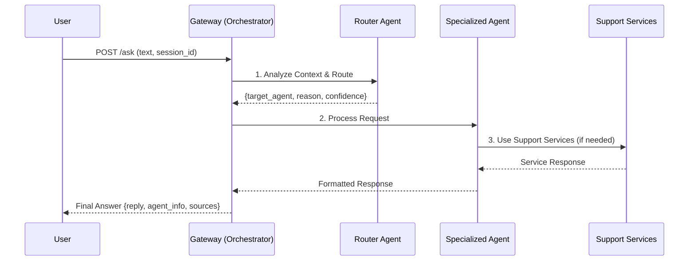

# Campus Helpdesk

Hệ thống hỗ trợ sinh viên thông minh sử dụng kiến trúc Multi-Agent với AI, được thiết kế để giải quyết các vấn đề và yêu cầu thường gặp của sinh viên.

## Kiến trúc Multi-Agent

Hệ thống hoạt động như một hệ thống multi-agent được điều phối thông minh, trong đó mỗi agent chuyên biệt về một lĩnh vực cụ thể:

### 🤖 **Các Agent Chuyên Biệt:**

-   **Router Agent**: Phân tích ngữ cảnh cuộc trò chuyện và định tuyến đến agent phù hợp
-   **Greeting Agent**: Xử lý lời chào và tạo bầu không khí thân thiện
-   **Technical Agent**: Hỗ trợ kỹ thuật IT (đặt lại mật khẩu, sự cố hệ thống)
-   **FAQ Agent**: Trả lời câu hỏi thông tin chung về quy định, thủ tục
-   **Gateway Service**: Điều phối toàn bộ hệ thống multi-agent

### 🔧 **Các Service Hỗ Trợ:**

-   **Policy Service**: Tìm kiếm thông tin từ knowledge base (RAG)
-   **Ticket Service**: Quản lý và theo dõi tickets hỗ trợ
-   **Action Service**: Thực hiện các hành động cụ thể (reset password, etc.)
-   **Escalation Service**: Tóm tắt và chuyển vấn đề phức tạp cho nhân viên
-   **Ingest Service**: Xử lý tin nhắn từ các kênh khác nhau (Zalo, Web)

## Luồng Hoạt Động Multi-Agent



### Quy Trình Xử Lý:

1.  **Tiếp Nhận Yêu Cầu**: User gửi tin nhắn đến Gateway với session_id để theo dõi ngữ cảnh
2.  **Phân Tích & Định Tuyến**: Router Agent phân tích tin nhắn và lịch sử chat, chọn agent phù hợp
3.  **Xử Lý Chuyên Biệt**: Agent được chọn xử lý yêu cầu với personality và expertise riêng
4.  **Hỗ Trợ Dịch Vụ**: Agent có thể gọi các service hỗ trợ (Policy, Action, Ticket)
5.  **Phản Hồi Cuối**: Gateway trả về câu trả lời kèm thông tin về agent đã xử lý

## Tính Năng Nổi Bật

### 🧠 **Thông Minh Ngữ Cảnh**
- Nhớ lịch sử cuộc trò chuyện qua session_id
- Hiểu được câu trả lời ngắn như "có", "không", "được"
- Phân tích ý định dựa trên ngữ cảnh

### 🎯 **Chuyên Biệt Hóa**
- Mỗi agent có personality và expertise riêng
- Trả lời tự nhiên như nhân viên hỗ trợ thực
- Dễ dàng mở rộng thêm agent mới

### 🔄 **Linh Hoạt**
- Hỗ trợ nhiều kênh (Web, Zalo, API)
- Tự động escalate vấn đề phức tạp
- Theo dõi và logging đầy đủ

## Cài Đặt và Chạy

### Yêu Cầu Hệ Thống

-   Docker và Docker Compose
-   Python 3.11+
-   File `.env` (copy từ `.env.example`)

### Hướng Dẫn Cài Đặt

1.  **Clone repository:**
    ```bash
    git clone https://github.com/your-repo/campus-helpdesk.git
    cd campus-helpdesk
    ```

2.  **Thiết lập môi trường:**
    ```bash
    cp .env.example .env
    # Chỉnh sửa file .env với các thông tin cần thiết
    ```

3.  **Chạy hệ thống:**
    ```bash
    docker-compose up --build -d
    ```

4.  **Truy cập ứng dụng:**
    - **Web Interface**: http://localhost:5173
    - **API Gateway**: http://localhost:8000
    - **Admin Dashboard**: http://localhost:5173/admin

## API Endpoints

### Gateway (Port 8000)

#### Chat với Multi-Agent System
```bash
POST /ask
Content-Type: application/json

{
    "channel": "web",
    "text": "Làm thế nào để đặt lại mật khẩu?",
    "student_id": "12345",
    "session_id": "unique-session-id"
}
```

**Response:**
```json
{
    "request_id": "uuid",
    "answer": {
        "reply": "Mình sẽ giúp bạn đặt lại mật khẩu...",
        "agent_info": {
            "agent": "technical",
            "routing_info": {
                "selected_agent": "technical",
                "reason": "Yêu cầu hỗ trợ kỹ thuật về mật khẩu",
                "confidence": 0.95
            },
            "suggested_action": {...},
            "sources": [...]
        }
    }
}
```

#### Kiểm Tra Tình Trạng Hệ Thống
```bash
GET /health
```

#### Xem Danh Sách Agents
```bash
GET /agents
```

### Policy Service (Port 8001)

-   `POST /ingest_policies`: Import tài liệu chính sách vào knowledge base
-   `POST /check`: Tìm kiếm thông tin liên quan từ knowledge base

## Cấu Hình LLM

Hệ thống hỗ trợ nhiều provider LLM:

```env
LLM_PROVIDER=openai|gemini|vllm|ollama
LLM_MODEL=gpt-4o-mini|gemini-1.5-flash
OPENAI_API_KEY=your-key
GOOGLE_API_KEY=your-key
```

Nếu không cấu hình LLM, hệ thống sẽ sử dụng stub logic đơn giản.

## Mở Rộng Hệ Thống

### Thêm Agent Mới

1. **Tạo Agent Class:**
   ```python
   # services/gateway/agents/schedule.py
   from .base import BaseAgent
   
   class ScheduleAgent(BaseAgent):
       def __init__(self):
           super().__init__("Schedule", "schedule.md")
       
       def process(self, user_message, chat_history, context=None):
           # Implementation
           pass
   ```

2. **Tạo System Prompt:**
   ```markdown
   # prompts/agents/schedule.md
   Bạn là chuyên viên tư vấn lịch học...
   ```

3. **Đăng Ký Agent:**
   ```python
   # services/gateway/agents/manager.py
   self.agents = {
       # ... existing agents
       "schedule": ScheduleAgent(),
   }
   ```

4. **Cập Nhật Router:**
   ```markdown
   # prompts/agents/router.md
   8. **schedule** - Agent Lịch học: Xem lịch học, lịch thi, thời khóa biểu
   ```

### Thêm Service Mới

Tạo service mới trong `services/` và thêm vào `docker-compose.yml`.

## Testing

```bash
# Cài đặt dependencies cho testing
pip install -r requirements-dev.txt

# Chạy tests
pytest tests/ -v
```

## Frontend

Ứng dụng web React với:
- **Giao diện chat** cho sinh viên tại `/`
- **Dashboard admin** tại `/admin`
- **Real-time messaging** với session tracking
- **Responsive design** với Tailwind CSS

## Monitoring & Logging

- **Health checks** tại `/health`
- **Agent performance** tracking
- **Redis** cho session management
- **MySQL** cho ticket storage

## Đóng Góp

1. Fork repository
2. Tạo feature branch (`git checkout -b feature/AmazingFeature`)
3. Commit changes (`git commit -m 'Add some AmazingFeature'`)
4. Push to branch (`git push origin feature/AmazingFeature`)
5. Tạo Pull Request

## License

Distributed under the MIT License. See `LICENSE` for more information.
